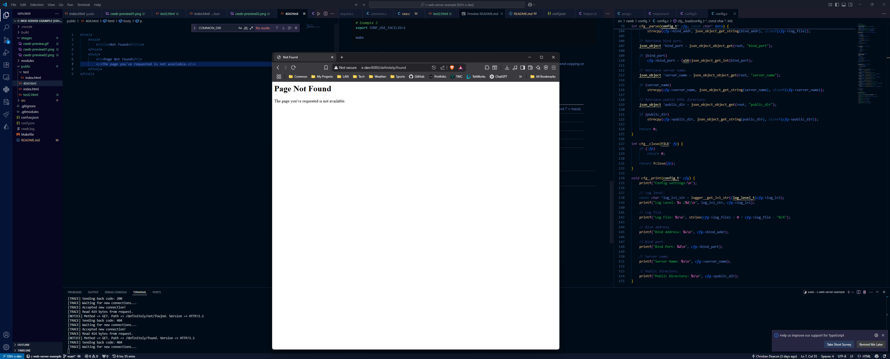

This is a **low-level**, **multithreaded** web server written in C. This project is a work-in-progress and I'm using it to learn more about web servers in general. There is also a basic HTTP **stress tool** (`cweb-stress`) included in this repository that sends HTTP requests to a host from **one or more threads** (multithreaded)!  

While the web server is in a runnable state, it is **not ready for production use**. I'm not entirely sure if I'll make this ready for production in the future. It will take a lot of time, but hey, maybe some day!


## HTML File System
At this time, the web server implements a basic HTML file system. The URI paths from a HTTP request is mapped to the file system in [`public/`](./public/), but can be changed with the `public_dir` configuration setting detailed later on in this README. For example, say you're using the domain `test123.com`.

* `test123.com` => [`./public/index.html`](./public/index.html)
* `test123.com/test` => [`./public/test/index.html`](./public/test/index.html)
* `test123.com/test2` => [`./public/test2.html`](./public/test2.html)
* `test123.com/definitely/not/found` => [`./public/404.html`](./public/404.html)

## Building
If you're cloning this project, make sure to clone all of its submodule(s) which includes [JSON-C](https://github.com/json-c/json-c) (required).

You can do this by passing the `--recursive` flag when cloning the repository like below.

```bash
git clone --recursive https://github.com/gamemann/cweb.git
```

If you've already cloned the repository, you can execute the following command inside of the cloned repository to download the submodules.

```bash
git submodule update --init
```

### Building & Installing JSON-C
The [JSON-C](https://github.com/json-c/json-c) library is required to read the config file.

I've made some chains in the Makefile that makes it easier to build and install JSON-C.

To build JSON-C, use the following command.

```bash
make json-c
```

To install JSON-C to the system, use the following command as root (or via `sudo`).

```bash
make json-c-install
```

### Building & Installing Main Program
To build the main project, simply use the command below.

```bash
make
```

To install the project to the system (`cweb` executable), use the following command as root (or via `sudo`).

```bash
make install
```

## Command Line Usage
### CWeb
The following command line arguments are supported for `cweb`.

| Argument | Default | Description |
| -------- | ------- | ----------- |
| `-c --cfg <val>` | `./conf.json` | The path to the runtime config file. |
| `-l --list` | - | Prints the contents of the runtime config and exits. |
| `-h --help` | - | Prints the help menu and exits. |
| `-r --log-lvl <val>` | - | Overrides the log level runtime config value. |
| `-f --log-file <val>` | - | Overrides the log file runtime config value. |
| `-b --bind-addr <val>` | - | Overrides the bind address runtime config value. |
| `-p --bind-port <val>` | - | Overrides the bind port runtime config value. |

### CWeb Stress
The following command line arguments are supported for `cweb-stress`.

| Argument | Default | Description |
| -------- | ------- | ----------- |
| `--host -i <val>` | - | The host to send HTTP requests to (supports host names and IPs). |
| `--port -p <val>` | - | The port to send HTTP requests to. |
| `--domain -d <val>` | `localhost` | The domain to use (what the HTTP `Host` header is set to). |
| `--method -m <val>` | `GET` | The HTTP method to use. |
| `--path -r <val>` | `/` | The HTTP path to use. |
| `--http-version -v <val>` | `HTTP/1.1` | The HTTP version to use. |
| `--ua -u <val>` | - | The user agent to set (if unset, will not pass the `User-Agent` HTTP header). |
| `--body -b` | - | The HTTP body to send. |
| `--threads -t` | - | The amount of threads to create (if unset, will use amount of CPUs the host has). |
| `--send-delay -s` | `0` | The amount of time in microseconds to wait between sending HTTP requests on each thread. Leaving this at 0 will result in the best performance, but if you don't want to send as many requests at once, raising this value is the solution. |
| `-l --list` | - | Prints the current CLI values. |
| `-h --help` | - | Prints the help menu and exits. |

## Configuration
A config file is loaded from the file system that is parsed using JSON. The default config file location is `./conf.json`. I recommend copying or renaming the [`conf.ex.json`](./conf.ex.json) file to `conf.json`.

Modifying runtime config values only requires a restart in the tool for new values to take effect.

The following runtime config options are available.

| Name | Type | Default | Description |
| ---- | ---- | ------- | ----------- |
| `log_lvl` | int | `7` | The log level (1 = fatal, 2 = error, 3 = warn, 4 = notice, 5 = info, 6 = debug, and 7 = trace). |
| `log_file` | string | `/var/log/cweb.log` | The path to the log file. |
| `bind_addr` | string | `0.0.0.0` | The address to bind the web server to. |
| `bind_port` | int | `8` | The port to bind the web server to. |
| `server_name` | string | `CWeb` | The name of the web server (set as the "Server" response header). |
| `public_dir` | string | `./public` | The path to the HTML file system. |
| `threads` | int | `0` | The amount of threads to set up to process web requests (0 = automatic). |
| `thread_type` | int | `0` | The thread type to use (0 = setup one global socket and poll socket on each thread, 1 = setup a separate socket per thread and poll it) |
| `allowed_hosts` | string/string array | `[]` | An array or single allowed hosts/domains. |
| `allowed_user_agents` | string/string array | `[]` | An array or single allowed user agents. |

## Images




## Credits
* [Christian Deacon](https://github.com/gamemann)